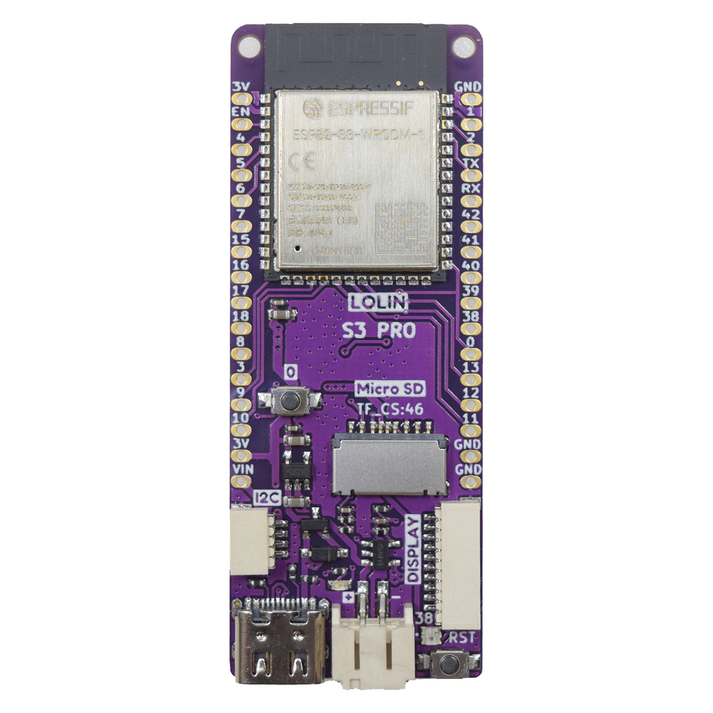
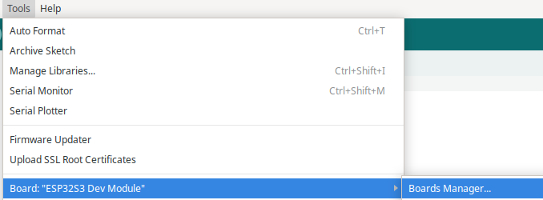
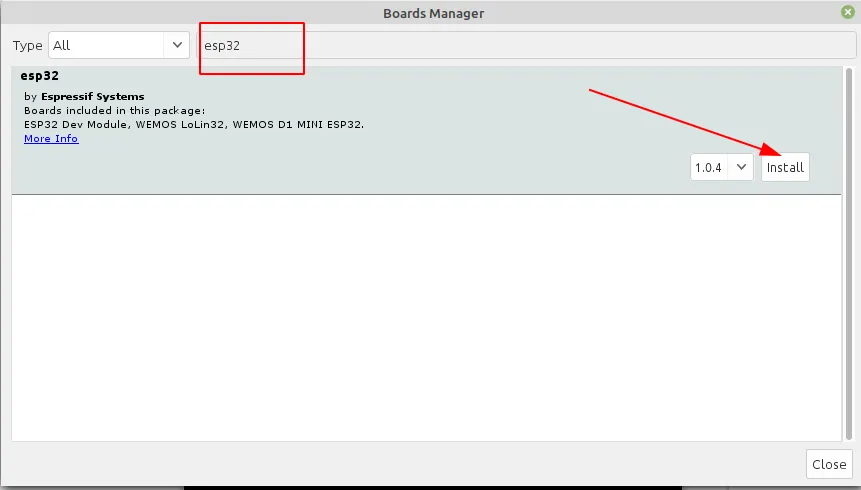
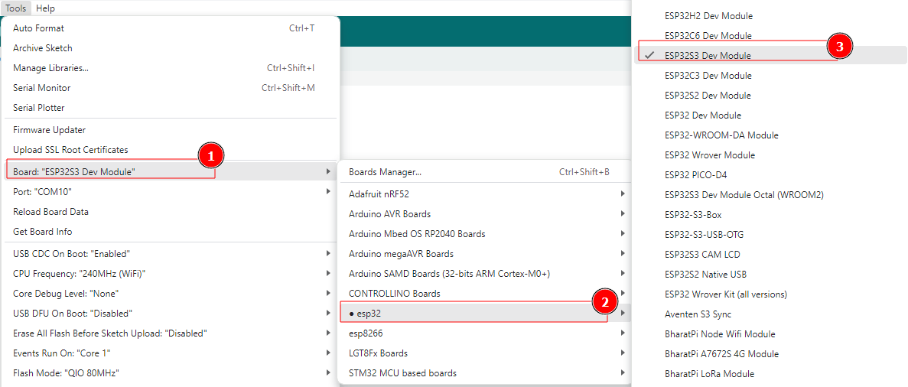
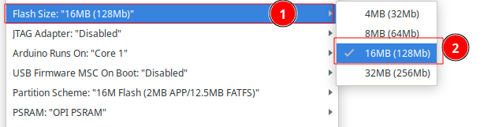
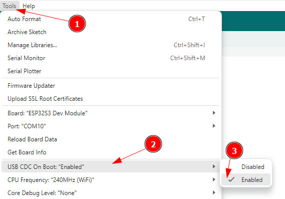
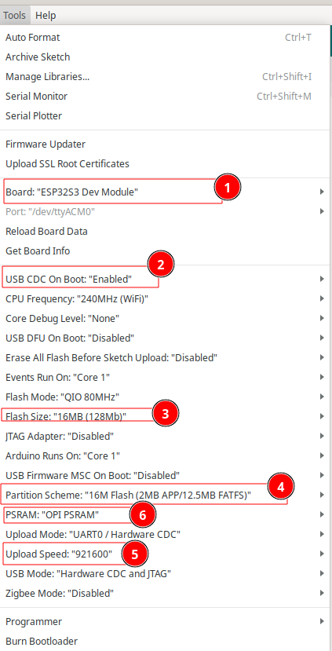
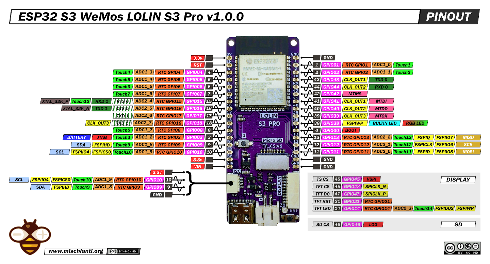

# Waveshare ESP32-S3 Relay





## Install Board

1. Masuk ke preferences


2. Klik Additional Board Manager


3. Tambahkan board esp32 kalimat berikut https://raw.githubusercontent.com/espressif/arduino-esp32/gh-pages/package_esp32_index.json


4. Pilih Tools -> Board -> Board Manager



5. Search ESP32 kemudian klik install



6. Pilih Tools -> Board -> ESP32 -> ESP32S3 dev Module



8. Langkah berikutnya adalah memastikan Arduino mengetahui Kapasitas Flash yang tersedia. Sebagai Info Waveshare ESP32-S3 Relay ini mempunya kapasitas FLASH 16MB dengan  PSRAM 8MB,  konfigurasi seperti pada gambar berikut




8. Pastikan USB CDC On boot Enable, Pada konfigurasi **ESP32-S3**, opsi **"USB CDC On Boot Enable"** berfungsi untuk mengaktifkan **USB Communications Device Class (CDC)** saat booting. Ini berarti bahwa ESP32-S3 akan langsung berfungsi sebagai perangkat **USB serial (CDC)** tanpa memerlukan chip USB-to-Serial tambahan.



9. Konfigurasi lengkap ditunjukkan oleh gambar berikut ini



## 1. Uji Coba Serial port

### Deskripsi

Tombol BOOT pada Waveshare ESP32-S3 Relay digunakan untuk membaca input digital. Dalam program ini, tombol BOOT yang terhubung ke pin GP0 akan diuji untuk mendeteksi apakah tombol ditekan atau tidak. Hasil pembacaan akan ditampilkan melalui Serial Monitor.

```c++
#define BOOT_KEY 0

void setup() {
    Serial.begin(115200);
    while(!Serial);
    pinMode(BOOT_KEY, INPUT_PULLUP);
    Serial.println("Serial Test Begin!");
    Delay(500);
    Serial.println("Tekan Tombol Boot!");
}

void loop() {
    if (digitalRead(BOOT_KEY) == LOW) {  // Hanya cetak saat tombol ditekan
        Serial.println("Tombol BOOT ditekan!");
        delay(200);  // Tambah delay biar tidak spam di serial
    }
}

```

> [!NOTE] 
>
> Pastikan USB CDC On boot Enable, Pada konfigurasi **ESP32-S3**, opsi **"USB CDC On Boot Enable"** 

### Penjelasan Kode

1. **Pendefinisian Pin**

   ```
   #define BOOT_KEY 0
   ```

   Pin GP0 digunakan untuk membaca status tombol BOOT.

2. **Inisialisasi dalam** `**setup()**`

   ```
   void setup() {
       Serial.begin(115200);
       while(!Serial);
       pinMode(BOOT_KEY, INPUT_PULLUP);
       Serial.println("Serial Test Begin!");
       delay(500);
       Serial.println("Tekan Tombol Boot!");
   }
   ```

   - `Serial.begin(115200);` menginisialisasi komunikasi serial dengan baud rate 115200.
   - `pinMode(BOOT_KEY, INPUT_PULLUP);` mengatur pin GP0 sebagai input dengan pull-up internal agar bernilai HIGH saat tombol tidak ditekan.

3. **Loop untuk Membaca Status Tombol**

   ```c++
   void loop() {
       if (digitalRead(BOOT_KEY) == LOW) {  // Hanya cetak saat tombol ditekan
           Serial.println("Tombol BOOT ditekan!");
           delay(200);  // Tambah delay biar tidak spam di serial
       }
   }
   ```

   - `digitalRead(BOOT_KEY);` membaca status tombol (). Jika ditekan  muncul tulisan diserial `"Tombol BOOT ditekan!"`
   - Status tombol ditampilkan di Serial Monitor.
   - `delay(200);` menambahkan jeda agar pembacaan lebih mudah dibaca.

### Cara Uji

1. **Persiapan Perangkat**
   - Pastikan **Waveshare ESP32-S3 Relay** dalam keadaan siap digunakan.
2. **Unggah Program**
   - Buka Arduino IDE atau PlatformIO.
   - Salin kode ke dalam editor.
   - Pilih board **ESP32-S3** yang sesuai.
   - Sambungkan ESP32-S3 ke komputer melalui USB.
   - Unggah kode ke board.
3. **Pengujian**
   - Buka **Serial Monitor** dengan baud rate **115200**.
   - Perhatikan nilai yang ditampilkan:
     - Jika tombol ditekan, nilai yang muncul info `"Tombol BOOT ditekan!"` 
   - Tekan dan lepaskan tombol BOOT beberapa kali untuk melihat perubahan nilai.

Dengan demikian, kita berhasil menguji fungsi tombol BOOT pada Waveshare ESP32-S3 Relay!


## 2. Uji WS21812

### Deskripsi

Pada proyek ini, kita akan menguji fungsi LED WS2812 yang terdapat pada Waveshare ESP32-S3 Relay. Program ini akan menyalakan LED dengan warna biru dan kemudian mematikannya secara berkedip dengan interval 50 milidetik.

```c++
#include "FastLED.h"

#define DATA_PIN 38       // Pin data LED
#define LED_TYPE WS2812  // Tipe LED
#define NUM_LEDS 1       // Jumlah LED
#define COLOR_ORDER RGB  // Urutan warna

CRGB leds[NUM_LEDS];
uint8_t brightness = 128;

void setup() {
  FastLED.addLeds<LED_TYPE, DATA_PIN, COLOR_ORDER>(leds, NUM_LEDS);
  FastLED.setBrightness(brightness);
}

void loop() {
  leds[0] = CRGB::Blue;
  FastLED.show();
  delay(50);

  leds[0] = CRGB::Black;
  FastLED.show();
  delay(50);
}
```

### Penjelasan Kode

1. **Pendefinisian Pin dan LED**

   ```c++
   #include "FastLED.h"
   
   #define DATA_PIN 38       // Pin data LED
   #define LED_TYPE WS2812  // Tipe LED
   #define NUM_LEDS 1       // Jumlah LED
   #define COLOR_ORDER RGB  // Urutan warna
   
   CRGB leds[NUM_LEDS];
   uint8_t brightness = 128;
   ```

   - Library `FastLED` digunakan untuk mengontrol LED WS2812.
   - Pin `DATA_PIN` diatur sebagai output untuk mengendalikan LED.
   - LED memiliki urutan warna RGB dan tingkat kecerahan yang dapat diatur.

2. **Inisialisasi dalam** `**setup()**`

   ```c++
   void setup() {
       FastLED.addLeds<LED_TYPE, DATA_PIN, COLOR_ORDER>(leds, NUM_LEDS);
       FastLED.setBrightness(brightness);
   }
   ```

   - `FastLED.addLeds` digunakan untuk mengatur konfigurasi LED.
   - `FastLED.setBrightness` mengatur tingkat kecerahan LED.

3. **Loop untuk Mengontrol LED**

   ```c++
   void loop() {
       leds[0] = CRGB::Blue;
       FastLED.show();
       delay(50);
   
       leds[0] = CRGB::Black;
       FastLED.show();
       delay(50);
   }
   ```

   - LED menyala dengan warna biru lalu mati secara berkedip setiap 50 milidetik.

### Cara Uji

1. **Unggah Program**

   - Buka Arduino IDE atau PlatformIO.
   - Salin kode ke dalam editor.
   - Pilih board **ESP32-S3** yang sesuai.
   - Sambungkan ESP32-S3 ke komputer melalui USB.
   - Unggah kode ke board.

2. **Pengujian**

   - Perhatikan LED WS2812 apakah berkedip sesuai dengan program.

## WIRING





​     